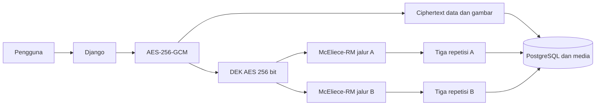

# Aplikasi Pengamanan Data Penduduk

Aplikasi web berbasis Django untuk menyimpan, mengenkripsi, menampilkan, dan
mengelola data penduduk. Data teks dan byte gambar dienkripsi menggunakan
AES-256-GCM. Data Encryption Key (DEK) dilindungi dengan implementasi
eksperimental McEliece berbasis kode Reed-Muller RM(1,4), menggunakan
double wrapping dan tiga repetisi pada masing-masing jalur pembungkus.

**Aplikasi:** [onlinetest-production-c4ea.up.railway.app](https://onlinetest-production-c4ea.up.railway.app/)

## Fitur

- Autentikasi pengguna menggunakan Django authentication.
- Input nama, data password, NIK, alamat, dan foto.
- Enkripsi teks dan byte file gambar dengan AES-256-GCM.
- DEK AES yang berbeda untuk setiap rekaman.
- Double wrapping DEK melalui jalur A dan B.
- Tiga salinan wrapped DEK pada setiap jalur.
- Visualisasi cipher image dan ciphertext teks.
- Dekripsi data untuk pengguna yang berhak.
- Pengguna biasa hanya dapat melihat rekaman miliknya.
- Superuser dapat melihat seluruh data dan mengelola pengguna.
- Tampilan latensi akses basis data dalam milidetik.
- Endpoint benchmark wrapping dan enkripsi gambar untuk superuser.
- Dukungan SQLite untuk pengembangan dan PostgreSQL untuk produksi.
- Konfigurasi deployment Railway.

## Arsitektur Keamanan



Alur penyimpanan:

1. Aplikasi membuat DEK AES 256 bit secara acak.
2. Data teks dan byte gambar dienkripsi menggunakan AES-GCM dengan nonce acak
   12 byte.
3. DEK dibungkus melalui dua jalur McEliece-RM, yaitu A dan B.
4. Masing-masing wrapped DEK disimpan tiga kali.
5. Ciphertext dan wrapped DEK disimpan pada basis data dan media terenkripsi.

Saat dekripsi, aplikasi memeriksa hak akses, memulihkan DEK dari salinan
wrapped DEK yang valid, memverifikasi tag autentikasi GCM, lalu menampilkan
plain data.

## Peran Pengguna

| Peran | Hak akses |
|---|---|
| Pengguna biasa | Login, menambah rekaman, melihat ciphertext, dan mendekripsi data miliknya |
| Superuser | Seluruh hak pengguna, melihat semua rekaman, mengelola akun, dan menjalankan benchmark |
| Pengembang/operator | Instalasi, migrasi, konfigurasi, deployment, backup, dan pemeliharaan |

## Teknologi

- Python 3.10
- Django 4.2
- `cryptography` dan AES-GCM
- NumPy, OpenCV, Pillow, dan SymPy
- SQLite untuk pengembangan lokal
- PostgreSQL untuk produksi
- Gunicorn dan WhiteNoise
- Railway

## Instalasi Lokal

### 1. Clone repositori

```bash
git clone https://github.com/khudzu/onlinetest.git
cd onlinetest
```

### 2. Buat dan aktifkan virtual environment

Linux/macOS:

```bash
python3 -m venv .venv
source .venv/bin/activate
```

Windows:

```powershell
py -m venv .venv
.venv\Scripts\activate
```

### 3. Instal dependensi

```bash
python -m pip install --upgrade pip
python -m pip install -r requirements.txt
```

### 4. Buat konfigurasi lokal

Buat file `.env` pada direktori project:

```env
SECRET_KEY=ganti-dengan-kunci-rahasia-yang-kuat
DEBUG=true
ALLOWED_HOSTS=127.0.0.1,localhost
```

Tanpa `DATABASE_URL`, aplikasi menggunakan SQLite.

### 5. Siapkan basis data dan akun admin

```bash
python manage.py migrate
python manage.py createsuperuser
```

### 6. Jalankan aplikasi

```bash
python manage.py runserver
```

Buka:

- Aplikasi: <http://127.0.0.1:8000/>
- Django Admin: <http://127.0.0.1:8000/admin/>

## Deployment Railway

1. Buat project Railway dan hubungkan dengan repositori ini.
2. Tambahkan layanan PostgreSQL.
3. Tambahkan variabel pada service Django.
4. Deploy service.
5. Buat public domain melalui **Settings > Networking**.
6. Verifikasi halaman `/login/`, `/data/`, dan `/admin/`.

Variabel yang diperlukan:

| Variabel | Nilai/keterangan |
|---|---|
| `DATABASE_URL` | `${{Postgres.DATABASE_URL}}` |
| `DATABASE_SSL_REQUIRE` | `false` untuk koneksi internal Railway, sesuaikan lingkungan |
| `DEBUG` | `false` |
| `SECRET_KEY` | Nilai acak, panjang, dan rahasia |
| `ALLOWED_HOSTS` | Domain Railway tanpa `https://` |
| `CSRF_TRUSTED_ORIGINS` | URL Railway lengkap dengan `https://` |
| `DJANGO_SUPERUSER_USERNAME` | Username administrator awal |
| `DJANGO_SUPERUSER_PASSWORD` | Password administrator awal |

`railway.json` menjalankan migrasi sebelum deployment. Perintah start kemudian
menjalankan migrasi, `collectstatic`, `ensure_superuser`, dan Gunicorn.

> Jangan menyimpan `SECRET_KEY`, password, atau `DATABASE_URL` di Git.
> Ganti password superuser segera setelah login pertama.

## Penggunaan

### Login

1. Buka `/login/`.
2. Masukkan username pada kolom **Nama**.
3. Masukkan password akun.
4. Tekan **Kirim**.

### Menambahkan data

1. Login ke aplikasi.
2. Buka **User > Registrasi** atau `/create/`.
3. Isi nama, data password, NIK, foto, dan alamat.
4. Tekan **Kirim**.
5. Aplikasi mengenkripsi data sebelum menyimpannya.

Kolom Password pada halaman login adalah password akun. Kolom Password pada
formulir Pendaftaran merupakan bagian dari data rekaman yang dienkripsi.

### Melihat ciphertext

Buka `/`. Halaman menampilkan ciphertext nama, alamat, NIK, cipher image, dan
latensi pembacaan basis data.

### Melihat data terdekripsi

Buka `/data/`. Pengguna biasa hanya melihat rekaman miliknya, sedangkan
superuser dapat melihat seluruh rekaman.

### Logout

Pilih **User > Logout** atau buka `/logout/`.

## Endpoint

| URL | Fungsi | Akses |
|---|---|---|
| `/` | Ciphertext dan cipher image | Login |
| `/login/` | Login aplikasi | Publik |
| `/logout/` | Mengakhiri sesi | Login |
| `/create/` | Menambahkan data | Login |
| `/data/` | Melihat data terdekripsi | Login |
| `/admin/` | Django Admin | Staff/superuser |
| `/benchmark/?samples=10` | Benchmark wrapping dan latensi | Superuser |
| `/benchmark/image-encryption/?runs=3` | Benchmark enkripsi gambar | Superuser |
| `/data/?latency_samples=10` | Benchmark wrapping melalui halaman data | Superuser |

## Pengujian

Jalankan test Django:

```bash
python manage.py test
```

Benchmark aplikasi dapat dijalankan melalui endpoint khusus superuser yang
tercantum pada tabel Endpoint.

## Penyimpanan dan Backup

- Backup PostgreSQL dan media terenkripsi secara terpisah.
- Filesystem container Railway dapat bersifat sementara.
- Gunakan Railway Volume atau object storage untuk file media yang harus
  bertahan setelah restart atau redeploy.
- Uji proses restore pada lingkungan nonproduksi.
- Jangan mengubah ciphertext, wrapped DEK, salt, atau nama file secara manual
  melalui Django Admin.

## Pemecahan Masalah

| Masalah | Tindakan |
|---|---|
| `Bad Request (400)` | Periksa `ALLOWED_HOSTS` dan `CSRF_TRUSTED_ORIGINS` |
| `no such table: auth_user` | Hubungkan PostgreSQL dan jalankan migrasi |
| `DATABASE_URL is required` | Tambahkan referensi `${{Postgres.DATABASE_URL}}` pada service Django |
| Login admin ditolak | Periksa akun, reset password, atau jalankan `ensure_superuser` |
| Gambar tidak tampil setelah redeploy | Gunakan volume persisten/object storage dan pulihkan backup |
| `Server Error (500)` | Periksa Deploy Logs dan traceback; jangan mengaktifkan `DEBUG` pada produksi |

## Batasan Keamanan

AES-256-GCM menggunakan implementasi dari pustaka `cryptography` dan
memberikan kerahasiaan serta autentikasi ciphertext.

Implementasi McEliece-RM(1,4) pada project ini dibuat untuk penelitian,
pembelajaran, dan pembuktian konsep. Parameter kodenya kecil, decoder memakai
pencarian codebook, dan implementasinya belum menjalani audit kriptografi
independen. Komponen tersebut **bukan implementasi kriptografi pascakuantum
siap produksi**.

Untuk penggunaan produksi pada data nyata, lakukan threat modeling, audit
keamanan, pengujian penetrasi, pengelolaan kunci yang memadai, dan gunakan
algoritma serta pustaka yang telah distandardisasi.

## Lisensi

Lihat [LICENSE](LICENSE) untuk ketentuan penggunaan source code.
